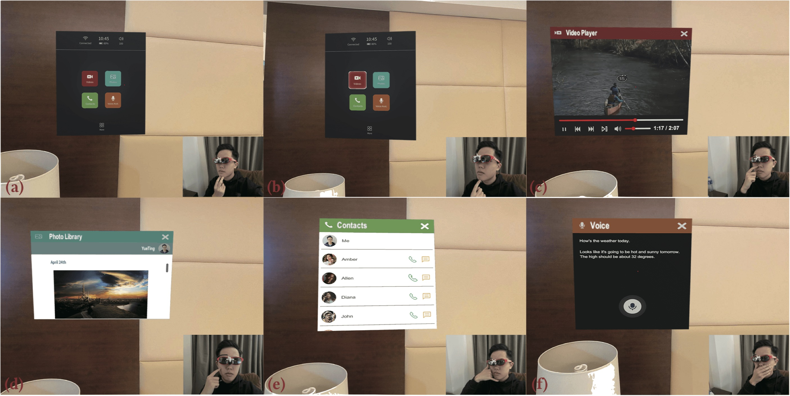

# FaceSight Application

## Paper Abstract
We present FaceSight, a computer vision-based hand-to-face gesture sensing technique for AR glasses. FaceSight fixes an infrared camera onto the bridge of AR glasses to provide extra sensing capability of the lower face and hand behaviors. We obtained 21 hand-to-face gestures and demonstrated the potential interaction benefits through five AR applications. We designed and implemented an algorithm pipeline that segments facial regions, detects hand-face contact (f1 score: 98.36\%), and trains convolutional neural network (CNN) models to classify the hand-to-face gestures. The input features include gesture recognition, nose deformation estimation, and continuous fingertip movement. Our algorithm achieves classification accuracy of all gestures at 83.06\%, proved by the data of 10 users. Due to the compact form factor and rich gestures, we recognize FaceSight as a practical solution to augment input capability of AR glasses in the future.

## Video Demo
The demonstrated AR applications with which you can perform on-face gestures to interact, including VideoPlayer, Photo Browser, Voice Assistant, etc. The applications were built on Nreal Light AR glasses which run the Android operating system. (Using NRSDK for unity development and vysor for distribution)

For more details, please refer to the [paper](https://pi.cs.tsinghua.edu.cn/lab/papers/FaceSight.pdf).

